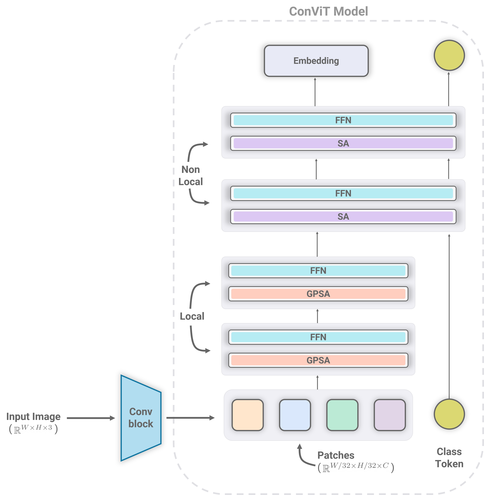
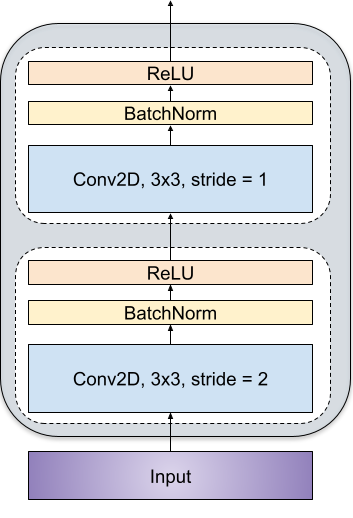
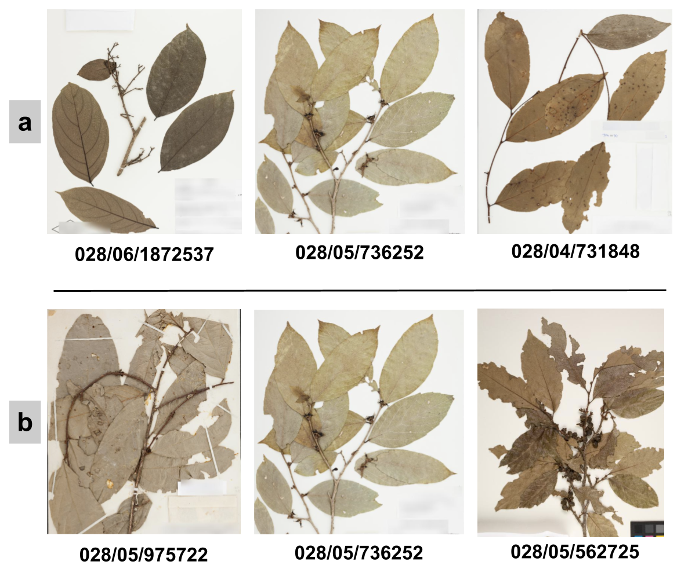

# Conviformer : Convolutionally guided Vision Transformers

[](https://paperswithcode.com/sota/fine-grained-image-classification-on-4?p=conviformers-convolutionally-guided-vision)

[](https://paperswithcode.com/sota/fine-grained-image-classification-on-5?p=conviformers-convolutionally-guided-vision)

[](https://paperswithcode.com/sota/image-classification-on-inaturalist-2019?p=conviformers-convolutionally-guided-vision)

This repository contains PyTorch code for Conviformer with ConViT base. But this is generic approach and can be applied with any vision transformer. 

Here is an architecture of the model:

<p align="center">
    
</p>

Convolutional block used to reduce the dimensional is as shown below:

<p align="center">
    
</p>


For details see the [Conviformer paper](https://arxiv.org/abs/2208.08900) by Mohit Vaishnav, Thomas Fel, Ivan Felipe Rodrıguez, Thomas Serre.

### Necessity for higher resolution

Here we show a examples from fina-grained classification task to demonstrate the need for higher resolution images. There exists a very high level of similarity between species of different sub-class and high variation between samples of the same sub-class. Such distinctions are often lost as we downscale the image to save the memory and computational cost associated with vision transformers (ViT). 

<p align="center">
    
</p>


## Usage

Install PyTorch 1.7.0+ and torchvision 0.8.1+ and [pytorch-image-models 0.3.2](https://github.com/rwightman/pytorch-image-models):

```
conda install -c pytorch pytorch torchvision
pip install timm==0.3.2
```

Rest of the depenencies are provided in `requirement.txt` file.

## Data preparation

Dataset is downloaded from `Kaggle Herbarium Challenge` page. We have evaluated `Conviformer` on [Herbarium 2021](https://www.kaggle.com/competitions/herbarium-2021-fgvc8) and [Herbarium 2022](https://kaggle.com/competitions/herbarium-2022-fgvc9/) dataset both of them are referred to as `Herbarium` and `Herbarium22` respectively in the code. 

### PreSizer

Dataset can be resized in accordance to our proposed smart resizing technique called `PreSizer`. The code for the same is provided as `presizer.py`. 

Two representative examples showing resizing-preserving. (a) Initial image from the Herbarium dataset. (b) Resizing the image when padding equally on both sides. When we follow equal padding around the sides, we lose relevant content. (c) Resizing the image following the PreSizer technique in which we remove the boundary pixels of width 20 pixels from all the sides and append the mirror reflection of the image to make it square

<p align="center">
    
</p>


## Evaluation
To evaluate Conviformer-Base on test set, run:

```
./eval.sh model_name input_size data_set checkpoint_path batch_size

```

## Training
To train Conviformer-Base on Herbarium 202x on a single node with ```n_gpus``` gpus and ```batch_size``` batch size for 300 epochs run:

```
./train_herbarium_patch batch_size n_gpus 
```

Similarly, for baseline reproducibility you may follow the above steps with 
```
./train_herbarium_base batch_size n_gpus 
``` 

## Citation

If you use this code for a paper please cite:

```
@article{vaishnav2022conviformers,
  title={Conviformers: Convolutionally guided Vision Transformer},
  author={Vaishnav, Mohit and Fel, Thomas and Rodr{\i}guez, Ivan Felipe and Serre, Thomas},
  journal={arXiv preprint arXiv:2208.08900},
  year={2022}
}
```

## License
The majority of this repository is released under the Apache 2.0 license as found in the [LICENSE](LICENSE) file.
